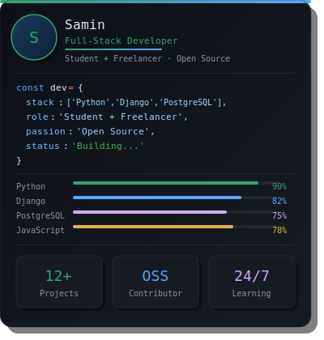

# Hello, I'm Samin ! 
## Full-Stack Developer | Python · Django · PostgreSQL | Open Source Enthusiast

<table>
<tr>
<td width="60%">

- Full-Stack Developer, experienced in building scalable and high-performance web applications.
- Skilled in designing RESTful APIs, backend systems, and responsive UIs.
- Passionate about clean, efficient, and maintainable code.
- Actively contributing to Open Source projects.
- Strong grip on Python, Django, PostgreSQL, and modern web technologies.
- Student + Freelancer — always learning, always building.

</td>
</tr>
</table>

---

### About Me

<table>
<tr>
<td width="55%" valign="top">

I believe that great software has the power to change the world — and I am on a mission to be part of that change. As a Software Engineering student and active Freelancer, I am building my journey one project at a time, turning ideas into real, impactful digital products.

Every challenge I face as a student sharpens my thinking. Every project I deliver as a freelancer strengthens my craft. I am not just learning to code — I am learning to solve real problems, build reliable systems, and create experiences that matter. My focus on Python, Django, and PostgreSQL drives me to build backends that are fast, scalable, and production-ready.

I am deeply passionate about Open Source — because I believe that the best way to grow is to contribute, collaborate, and give back to the community that teaches us all. My goal is clear: to become a world-class full-stack engineer who ships meaningful products, inspires others, and never stops growing.

</td>
<td width="45%" valign="top" align="center">

</td>
</tr>
</table>

---

## Tech Stack

**Core Technologies:**  
Python, Django, PostgreSQL, JavaScript, HTML5, CSS3, Tailwind CSS, Bootstrap, Java, WordPress, MySQL, Oracle

**Tools & DevOps:**  
Git, GitHub, Postman, Netlify, Render

**Additional Libraries:**  
Django REST Framework, Chart.js

---

## Connect with me

---

## GitHub Stats

